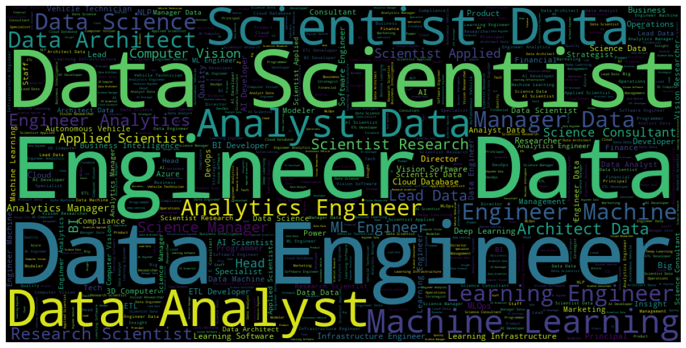

### Data Science Salaries 2023

### Dataset info

-   [x] work_year: The year the salary was paid. \*

-   [x] experience_level: The experience level in the job during the year

-   [x] \* employment_type: The type of employment for the role

-   [x] \* job_title: The role worked in during the year. \* salary: The total gross salary amount paid.

-   [x] \* salary_currency: The currency of the salary paid as an ISO 4217 currency code.

-   [x] \* salaryinusd: The salary in USD

-   [x] \* employee_residence: Employee's primary country of residence in during the work year as an ISO 3166 country code.

-   [x] \* remote_ratio: The overall amount of work done remotely

-   [x] \* company_location: The country of the employer's main office or contracting branch

-   [x] \* company_size: The median number of people that worked for the company during the year

#### Overview

-   [x] Data Cleaning and preprocessing
-   [x] Data Visualization
-   [x] Exploratory Data Analysis
-   [x] WordCloud
-   \[\] Model Building

#### Output of the project

